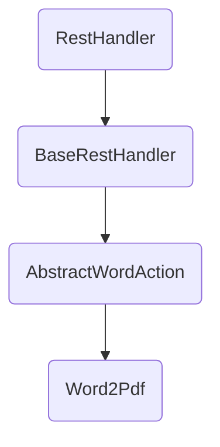

# 文件转换核心处理逻辑
## 背景
鉴于工作中经常会与文档打交道，在发与对方文档时一般会发送`PDF`文件，或者接收到对方发送到`PDF`文件，又或者其他，然而网络上到文件转换，不光转换效率有问题还收费，毕竟身为一个程序员，白漂才是最爽的吗，所以`ZFC文件转换`应运而生，通过整合网络上常见的文件转换方式，实现不同文件格式之间的转换
## 功能介绍

| 名称       | Itext | Aspose | PdfBox | Spire | 输入文件类型                           | 输出文件类型 |
|----------|-------|--------|--------|-------|----------------------------------|--------|
| Word2Pdf | 否     | 是      | 是      | 是     | doc、docx、txt、xml、rtf、htm、html、json | pdf    |
| Pdf2Word | x     | x      | x      | x     | pdf                              | doc    |

## 代码介绍
module 所有的模块包
 - common 转换代码时通用代码
 - core 文件转换核心代码
   - com.zuiyu.rest 所有的handler响应位置
   - action 响应URL位置
   - channel 响应信息返回
   - response 响应返回信息封装类型

## 参考连接
https://releases.aspose.com/
https://releases.aspose.com/java/repo
https://www.e-iceblue.cn/content/pdf_java_conversion.html


备忘录
1、求合集（总的支持转换方式=各个转换方式的合并）
2、前端提醒信息改为确认关闭，提示支持的转换文件类型




# 扩展
## 扩展转换方式
1、实现 BaseFileConvertService 接口
2、实现对应的接口
3、修改支持的类型，如下所示
```text
    private static final Map<FileHandlerEnum, List<String>> INCLUDE_TYPE_MAP =
            new HashMap<FileHandlerEnum, List<String>>() {{
                put(FileHandlerEnum.TEXT2PDF, Arrays.asList(
                        FileTypeEnum.DOC.name(),
                        FileTypeEnum.DOCX.name(),
                        FileTypeEnum.TXT.name(),

                        FileTypeEnum.RTF.name(),
                        FileTypeEnum.HTM.name(),
                        FileTypeEnum.HTML.name(),
                        FileTypeEnum.JSON.name()
                ));
                put(FileHandlerEnum.PDF2DOCX, Collections.singletonList(
                        FileTypeEnum.PDF.name()
                ));
            }};
```


# 问题记录
1、 The document is really a OOXML file

如果您的 Word 文档是 OOXML 格式（即以 .docx 或 .xlsx 等扩展名结尾的文档），则需要使用 Apache POI 来读取其中的内容。